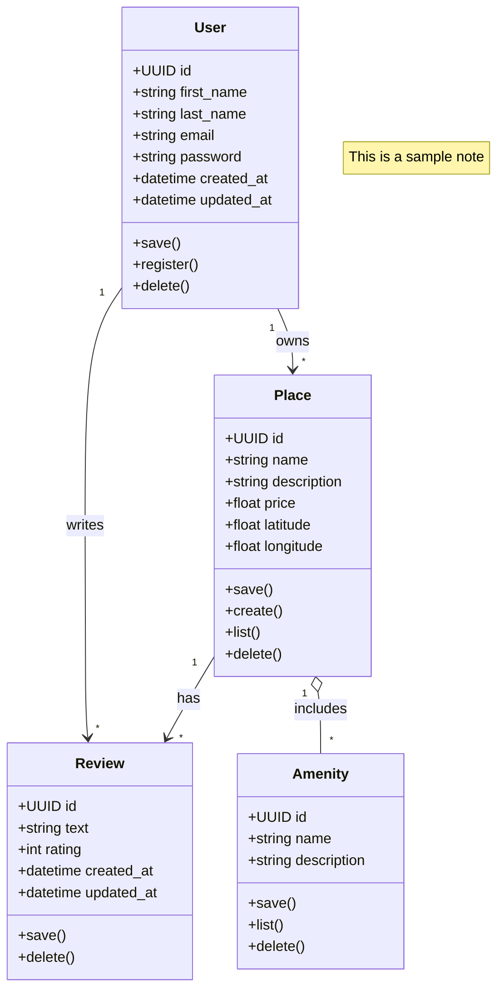

# holbertonschool-hbnb

```mermaid
classDiagram
direction TB
    class User {
        +UUID id
	    +string first_name
        +string last_name
	    +string email
	    +string password
	    +datetime created_at
	    +datetime updated_at
	    +save()
        +register()
	    +delete()
    }

    class Place {
        +UUID id
	    +string name
	    +string description
	    +float price
        +float latitude
        +float longitude
	    +save()
        +create()
        +list()
	    +delete()
    }

    class Review {
    +UUID id
    +string text
    +int rating
    +datetime created_at
    +datetime updated_at
    +save()
    +delete()
    }

    class Amenity {
	    +UUID id
	    +string name
	    +string description
	    +save()
        +list()
	    +delete()
    }

	note "This is a sample note"
    User "1" --> "*" Place : owns
    Place "1" --> "*" Review : has
    User "1" --> "*" Review : writes
    Place "1" o-- "*" Amenity : includes
```
