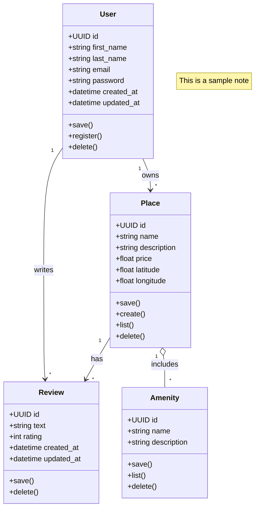
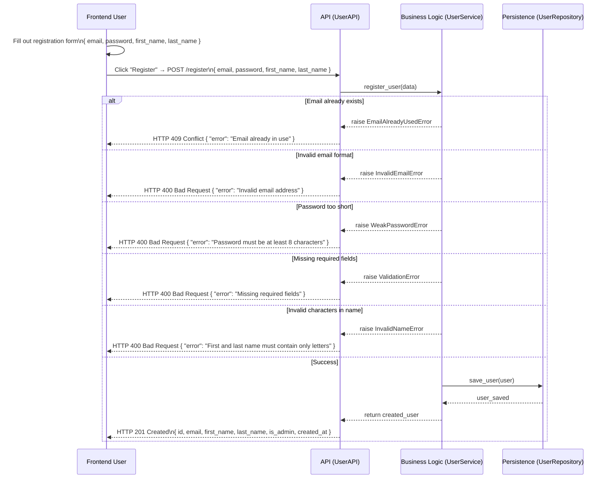

# Holbertonschool-HBNB
# Business Logic Layer – Class Diagram 

This document presents the **class diagram** for the Business Logic Layer of the **HBnB project**, modeled using **Mermaid.js** syntax. It defines the key entities, their attributes, methods, and the relationships between them, providing a clear abstraction of the core business logic.

---

## UML Class Diagram

 **Overview** 

User
Represents a platform user.

Attribute	Type	Description
id	UUID	Unique ID
first_name	string	First name
last_name	string	Last name
email	string	Unique email address
password	string	Hashed password
created_at	datetime	When user was created
updated_at	datetime	Last update time
Main methods: save(), register(), delete()

Place
Represents a property to rent or book.

Attribute	Type	Description
id	UUID	Unique ID
name	string	Property name
description	string	Description of place
price	float	Price per night
latitude	float	Location latitude
longitude	float	Location longitude
Main methods: save(), create(), list(), delete()

Review
Represents feedback by users on places.

Attribute	Type	Description
id	UUID	Unique ID
text	string	Review content
rating	int	Rating (e.g., 1 to 5)
created_at	datetime	Creation date
updated_at	datetime	Last update date
Main methods: save(), delete()

Amenity
Represents features offered at a place (Wi-Fi, pool, etc.).

Attribute	Type	Description
id	UUID	Unique ID
name	string	Amenity name
description	string	Details about amenity
Main methods: save(), list(), delete()

🔗 Relationships

Relationship	Description
User → Place	A user can own many places
Place → Review	A place can have many reviews
User → Review	A user can write many reviews
Place o-- Amenity	A place includes many amenities
📌 Notes

All entities use UUID for unique IDs.
Timestamp fields track creation and updates.
Methods like save() and delete() manage persistence.
Relationships use UML notation for clarity.
🛠 How to View

Use a Mermaid-compatible viewer (GitHub, VS Code extension).
Paste the Mermaid code in your Markdown .md file.
Or try online Mermaid editors.
📁 Project Location

This diagram corresponds to the Business Logic Layer
Found in part1/ folder of the holbertonschool-hbnb repo.

# Sequence Diagrams for API Calls 

## User Registration Sequence Diagram

This document describes the flow of the user registration process in the HBnB project using a **Mermaid.js sequence diagram**. It captures both frontend interactions and backend business logic processing, including validation, error handling, and data persistence.

---

 Legend

| Participant        | Description                                                                 |
| ------------------ | --------------------------------------------------------------------------- |
| **User**           | The frontend user interacting with the registration form.                   |
| **APIService**     | The backend API receiving and routing requests (e.g., Flask, FastAPI).      |
| **UserLogic**      | The business logic validating data and applying registration rules.         |
| **UserRepository** | Handles saving and retrieving user data from the database or storage layer. |

