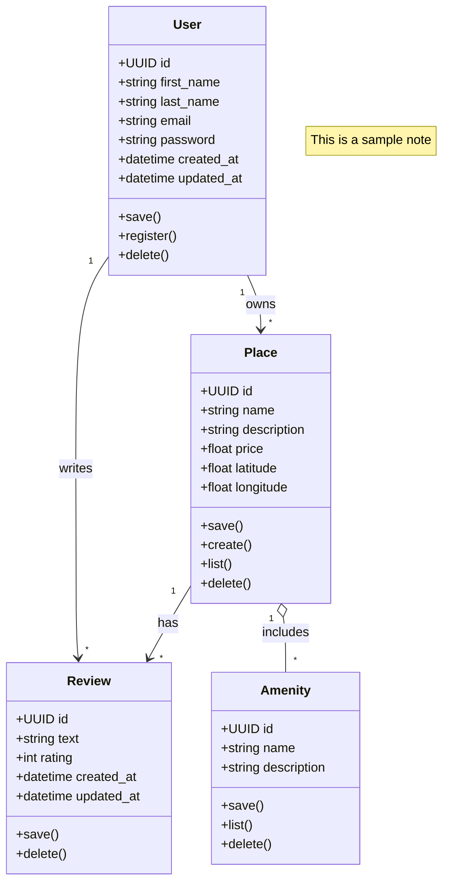

# holbertonschool-hbnb


# Sequence Diagrams for API Calls 

## User Registration Sequence Diagram

This document describes the flow of the user registration process in the HBnB project using a **Mermaid.js sequence diagram**. It captures both frontend interactions and backend business logic processing, including validation, error handling, and data persistence.

---

```mermaid
sequenceDiagram
    participant User as Frontend User
    participant APIService as API (UserAPI)
    participant UserLogic as Business Logic (UserService)
    participant UserRepository as Persistence (UserRepository)

    User->>User: Fill out registration form\n{ email, password, first_name, last_name }
    User->>APIService: Click "Register" → POST /register\n{ email, password, first_name, last_name }
    APIService->>UserLogic: register_user(data)

    alt Email already exists
        UserLogic-->>APIService: raise EmailAlreadyUsedError
        APIService-->>User: HTTP 409 Conflict { "error": "Email already in use" }

    else Invalid email format
        UserLogic-->>APIService: raise InvalidEmailError
        APIService-->>User: HTTP 400 Bad Request { "error": "Invalid email address" }

    else Password too short
        UserLogic-->>APIService: raise WeakPasswordError
        APIService-->>User: HTTP 400 Bad Request { "error": "Password must be at least 8 characters" }

    else Missing required fields
        UserLogic-->>APIService: raise ValidationError
        APIService-->>User: HTTP 400 Bad Request { "error": "Missing required fields" }

    else Invalid characters in name
        UserLogic-->>APIService: raise InvalidNameError
        APIService-->>User: HTTP 400 Bad Request { "error": "First and last name must contain only letters" }

    else Success
        UserLogic->>UserRepository: save_user(user)
        UserRepository-->>UserLogic: user_saved
        UserLogic-->>APIService: return created_user
        APIService-->>User: HTTP 201 Created\n{ id, email, first_name, last_name, is_admin, created_at }
    end
