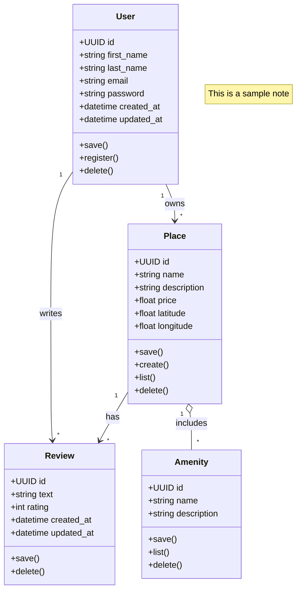
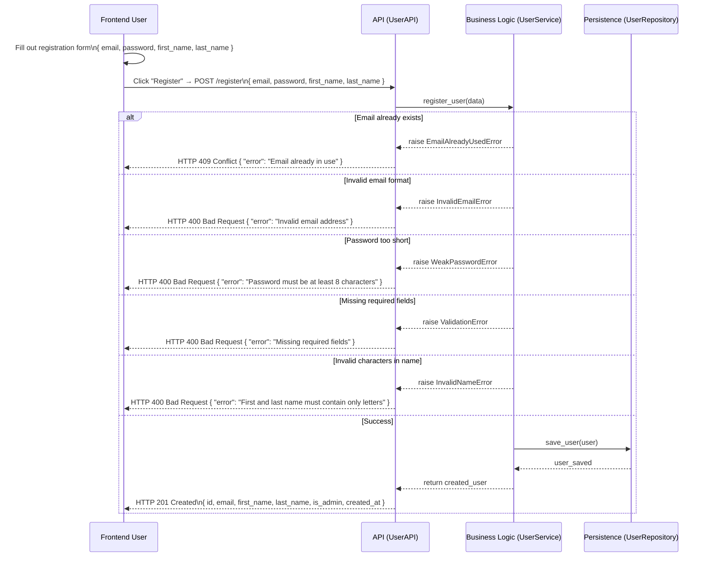
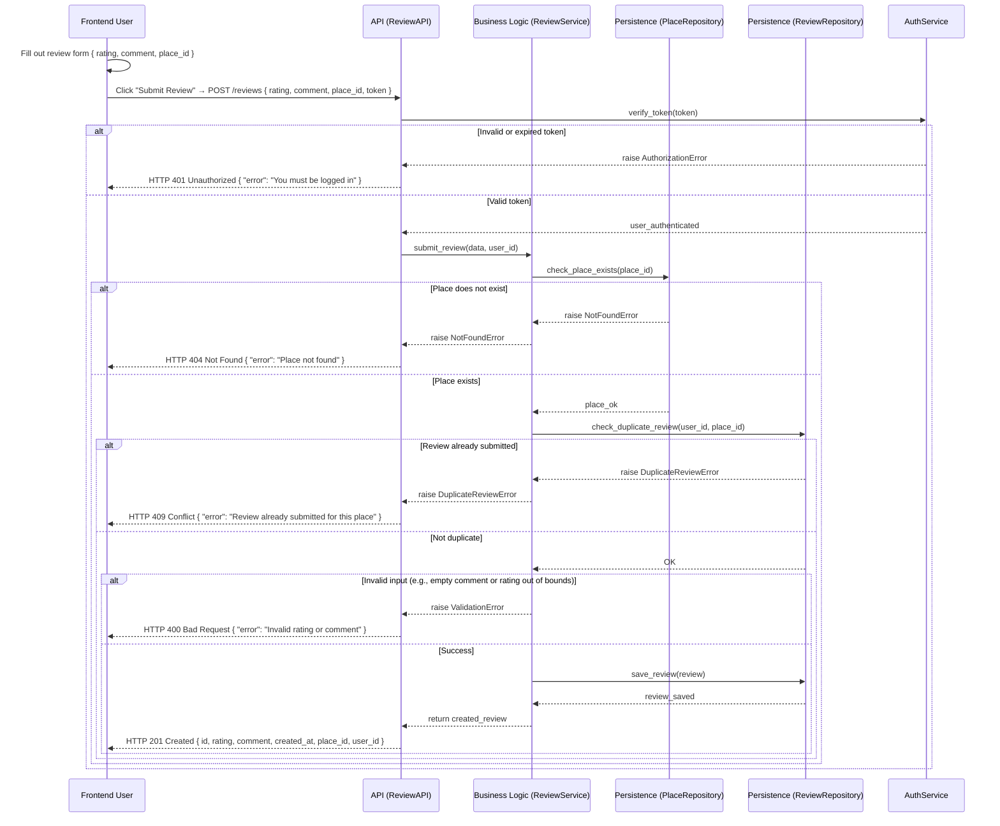
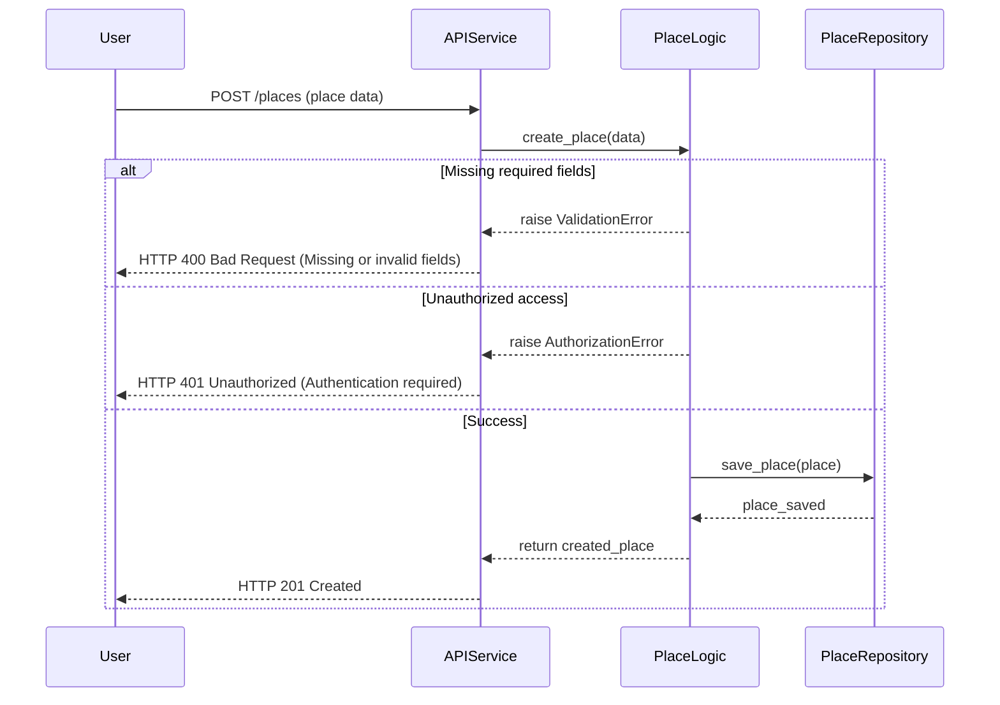
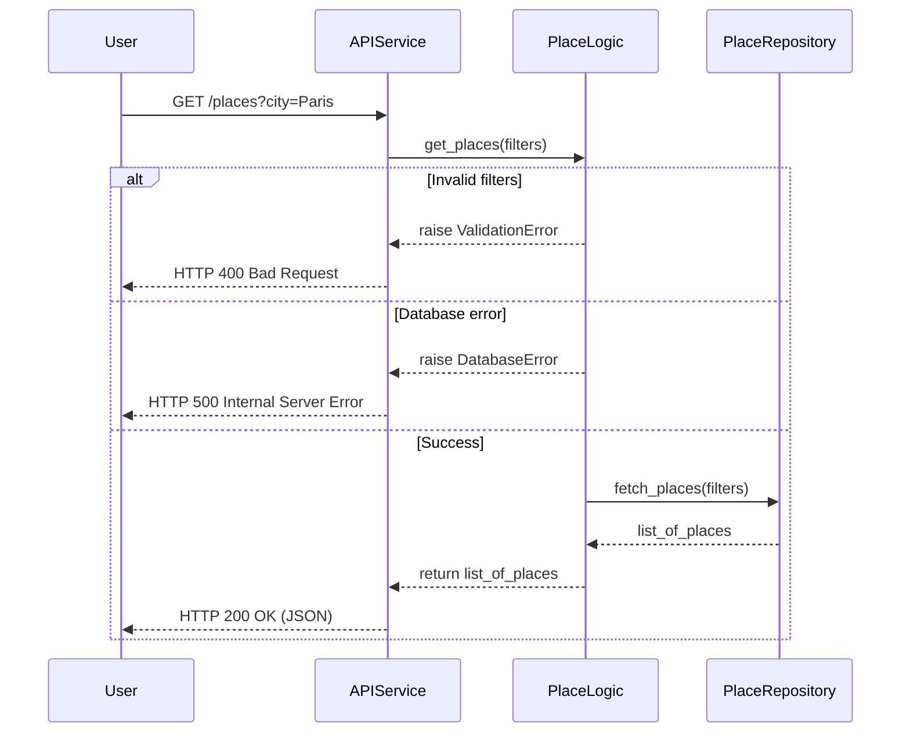

# Holbertonschool-HBNB

# High-Level Package Diagram

this diagram that illustrates the three-layer architecture of the HBnB application and the communication between these layers via the facade pattern

# Business Logic Layer – Class Diagram 

This document presents the **class diagram** for the Business Logic Layer of the **HBnB project**, modeled using **Mermaid.js** syntax. It defines the key entities, their attributes, methods, and the relationships between them, providing a clear abstraction of the core business logic.

---

## UML Class Diagram

## Overview

### User  
Represents an individual using the platform.

| Attribute   | Type     | Description                |
|-------------|----------|----------------------------|
| id          | UUID     | Unique identifier           |
| first_name  | string   | User's first name           |
| last_name   | string   | User's last name            |
| email       | string   | Email address (unique)      |
| password    | string   | Hashed password             |
| created_at  | datetime | Record creation timestamp   |
| updated_at  | datetime | Last update timestamp       |

**Key Methods:** `save()`, `register()`, `delete()`

---

### Place  
Represents a property available for booking or rental.

| Attribute   | Type     | Description                |
|-------------|----------|----------------------------|
| id          | UUID     | Unique identifier           |
| name        | string   | Property name               |
| description | string   | Property description        |
| price       | float    | Price per night             |
| latitude    | float    | Geographic latitude         |
| longitude   | float    | Geographic longitude        |

**Key Methods:** `save()`, `create()`, `list()`, `delete()`

---

### Review  
Represents user feedback for a place.

| Attribute   | Type     | Description                   |
|-------------|----------|-------------------------------|
| id          | UUID     | Unique identifier              |
| text        | string   | Review content                 |
| rating      | int      | Numeric rating (e.g., 1-5)    |
| created_at  | datetime | Timestamp of review creation   |
| updated_at  | datetime | Timestamp of last update       |

**Key Methods:** `save()`, `delete()`

---

### Amenity  
Represents a feature or facility provided at a place (e.g., Wi-Fi, pool).

| Attribute   | Type     | Description                  |
|-------------|----------|------------------------------|
| id          | UUID     | Unique identifier             |
| name        | string   | Name of the amenity           |
| description | string   | Amenity details               |

**Key Methods:** `save()`, `list()`, `delete()`

# Sequence Diagrams for API Calls 

## User Registration Sequence Diagram

This document describes the flow of the user registration process in the HBnB project using a **Mermaid.js sequence diagram**. It captures both frontend interactions and backend business logic processing, including validation, error handling, and data persistence.

---

 Legend

| Participant        | Description                                                                 |
| ------------------ | --------------------------------------------------------------------------- |
| User           | The frontend user interacting with the registration form.                   |
| APIService     | The backend API receiving and routing requests (e.g., Flask, FastAPI).      |
| UserLogic      | The business logic validating data and applying registration rules.         |
| UserRepository | Handles saving and retrieving user data from the database or storage layer. |

## Review Submission Flow – Sequence Diagram

This diagram shows how a user submits a review in the HBnB project.
It includes what the user does on the frontend, how the API handles it, and how the backend checks and saves the review.

## Overview

| Component        | Role                                                      |
|------------------|-----------------------------------------------------------|
| Frontend User    | Fills and submits the review form                         |
| APIService       | Entry point for handling `/reviews` POST requests         |
| AuthService      | Verifies and validates the user's access token            |
| ReviewLogic      | Core logic: validation, duplication check, save           |
| PlaceRepository  | Checks if the place to review exists                      |
| ReviewRepository | Detects duplicate reviews and saves review data           |

## Place Creation – Sequence Diagram

This diagram show **Place creation flow** in the HBnB project. It describes how the system processes a user request to create a new place, covering frontend interaction, backend logic, and error handling.

## Overview

| Component         | Role                                                             |
|------------------|------------------------------------------------------------------|
| Frontend User     | Fills and submits the review form                                |
| Display           | Shows UI messages or errors to the user                          |
| APIService        | Entry point for handling `/reviews` POST requests                |
| AuthService       | Verifies and validates the user's access token                   |
| ReviewLogic       | Core logic: validation, duplication check, save                  |
| PlaceRepository   | Checks if the place to review exists                             |
| ReviewRepository  | Detects duplicate and saves review data                          |

## List Places - Sequence Diagram 

This digram describes the flow of retrieving a list of places through the HBnB API, including error handling.

## Overview 

| Component       | Role                                              |
|-----------------|---------------------------------------------------|
| User       | The user making the request                        |
| APIService  | API entry point handling the request              |
| PlaceLogic  | Business logic: validation, error handling, filtering |
| PlaceRepository | Data access layer retrieving places from the database |

## documentation 
https://docs.google.com/document/d/1setrbs93z5_2LNSnfRO_MrhQFYcA0MgyF7hTyRmvdKw/edit?usp=sharing
